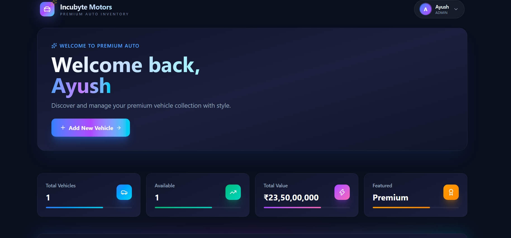
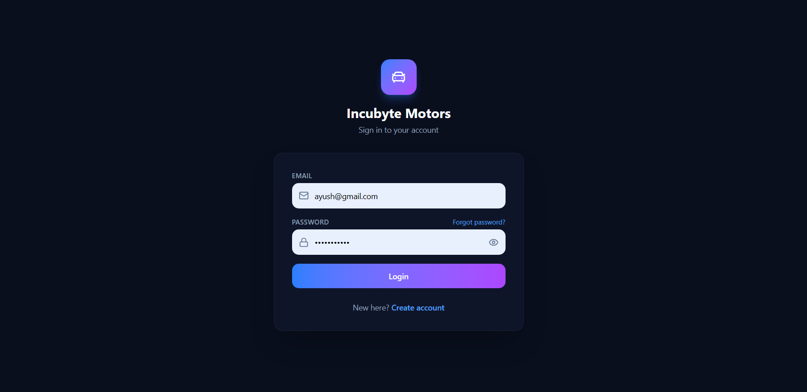
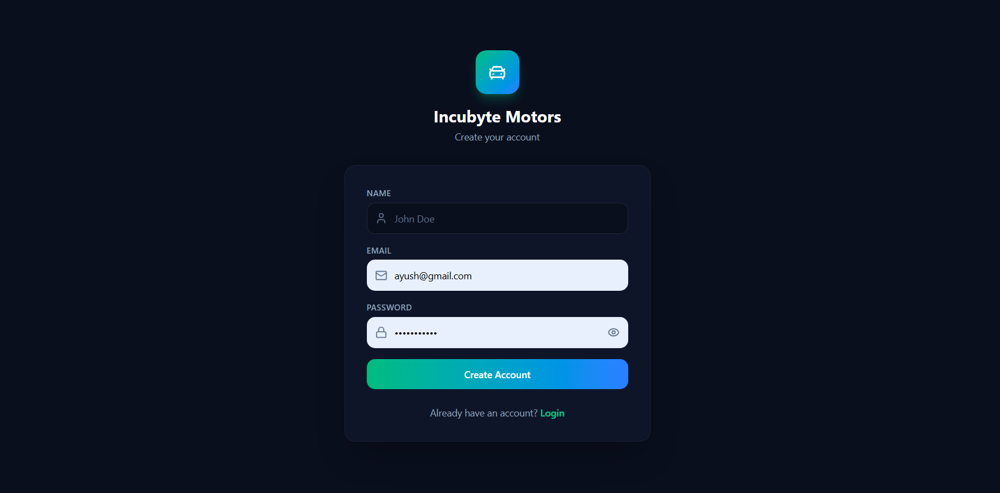
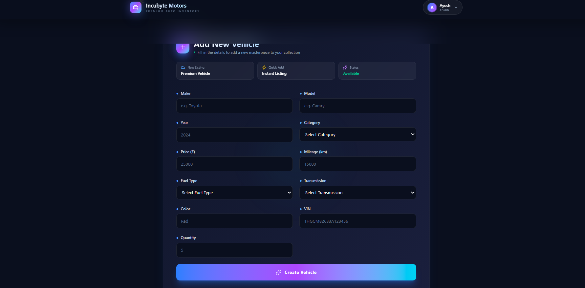
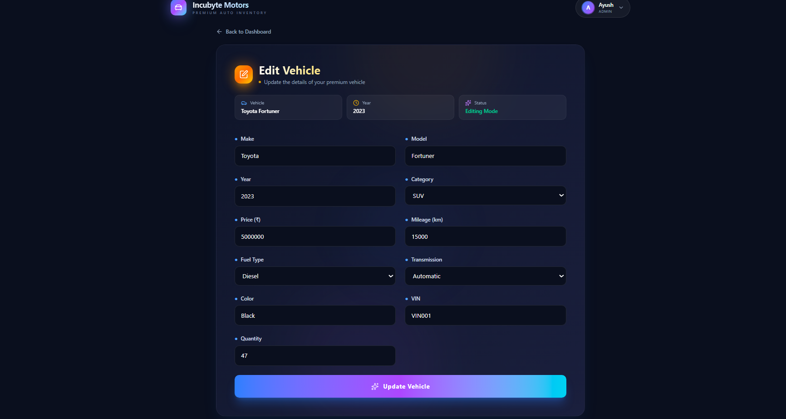

# 🚗 Incubyte Motors

A modern full-stack **Car Dealership Inventory Management System** built with **React, TypeScript, Express.js, MongoDB Atlas, and JWT Authentication**.

Designed as part of the **Incubyte Full Stack TDD Assessment**, the project demonstrates secure authentication, role-based access control, inventory management, automated testing, and production-oriented project structure.




---

# ✨ Features

- 🔐 JWT Authentication & Authorization
- 👥 Admin and Customer Roles
- 🚗 Complete Vehicle Inventory Management
- 🛒 Vehicle Purchase Workflow
- ♻️ Inventory Restocking
- 🔍 Vehicle Search
- 📱 Responsive UI
- 🧪 Automated Backend Testing (Jest + Supertest)
- ✅ Request Validation using Zod
- ⚡ Built with TypeScript

---

# 📸 Application Screenshots

## Dashboard


---

## Login



---

## Register



---

## Add Vehicle



---

## Edit Vehicle



---

# 🛠 Tech Stack

## Frontend

- React
- TypeScript
- Vite
- Tailwind CSS
- React Router
- Axios
- React Hook Form
- Zod

## Backend

- Node.js
- Express.js
- MongoDB Atlas
- Mongoose
- JWT
- bcrypt
- Zod

## Testing

- Jest
- Supertest

---

# 📂 Project Structure

```text
car-dealership-inventory/
│
├── backend/
├── frontend/
├── docs/
│   ├── screenshots/
│   ├── api.md
│   ├── architecture.md
│   ├── testing.md
│   ├── ai-usage.md
│   └── changelog.md
│
├── README.md
├── PROMPTS.md
└── LICENSE
```

---

# 🚀 Getting Started

## Clone Repository

```bash
git clone https://github.com/<your-username>/incubyte-car-dealership-inventory.git

cd incubyte-car-dealership-inventory
```

---

## Backend

```bash
cd backend

npm install

npm run dev
```

Create a `.env` file:

```env
PORT=5000
MONGO_URI=your_mongodb_connection_string
JWT_SECRET=your_secret_key
```

---

## Frontend

```bash
cd frontend

npm install

npm run dev
```

The application will be available at:

```
Frontend
http://localhost:5173

Backend
http://localhost:5000
```

---

# 🔐 User Roles

## Customer

- Browse Vehicles
- Search Inventory
- Purchase Vehicles

## Administrator

Everything available to customers, plus:

- Add Vehicles
- Edit Vehicles
- Delete Vehicles
- Restock Inventory

---

# 🔌 API Overview

| Method | Endpoint | Description |
|---------|----------|-------------|
| POST | `/api/auth/register` | Register User |
| POST | `/api/auth/login` | Login |
| GET | `/api/vehicles` | Get Vehicles |
| POST | `/api/vehicles` | Add Vehicle *(Admin)* |
| PUT | `/api/vehicles/:id` | Update Vehicle *(Admin)* |
| DELETE | `/api/vehicles/:id` | Delete Vehicle *(Admin)* |
| POST | `/api/vehicles/:id/purchase` | Purchase Vehicle |
| POST | `/api/vehicles/:id/restock` | Restock Vehicle *(Admin)* |

📄 Complete API documentation: **docs/api.md**

---

# 🧪 Testing

The backend is tested using **Jest** and **Supertest**.

| Metric | Result |
|---------|--------|
| Test Suites | 15 |
| Total Tests | 25 |
| Passing | ✅ 25 |
| Failed | 0 |

Run tests:

```bash
cd backend

npm test
```

📄 Detailed testing documentation: **docs/testing.md**

---

# 📚 Documentation

Additional documentation is available inside the `docs` directory.

| Document | Description |
|----------|-------------|
| `api.md` | REST API Reference |
| `architecture.md` | System Architecture |
| `testing.md` | Testing Strategy |
| `ai-usage.md` | Responsible AI Usage |
| `changelog.md` | Version History |
| `PROMPTS.md` | AI Prompt History |

---

# 🤖 AI Usage

AI tools were used responsibly to assist with:

- Architecture discussions
- Debugging
- Documentation
- Code reviews
- Development guidance

Every AI-generated suggestion was manually reviewed, tested, and integrated before being included in the project.

See:

- `docs/ai-usage.md`
- `PROMPTS.md`

---

# 🚀 Future Improvements

- Vehicle Image Upload
- Pagination
- Advanced Filtering
- Customer Purchase History
- Sales Dashboard
- Docker Support
- CI/CD Pipeline
- Frontend Testing
- End-to-End Testing

---

# 👨‍💻 Author

**Ayush Dubey**

B.Tech Computer Science Engineering

PortFolio: https://ayush-portfolio-live.vercel.app/

GitHub: https://github.com/ayushd25

LinkedIn: https://www.linkedin.com/in/ayushd25/

---

# 📄 License

This project is licensed under the **MIT License**.

See the `LICENSE` file for details.